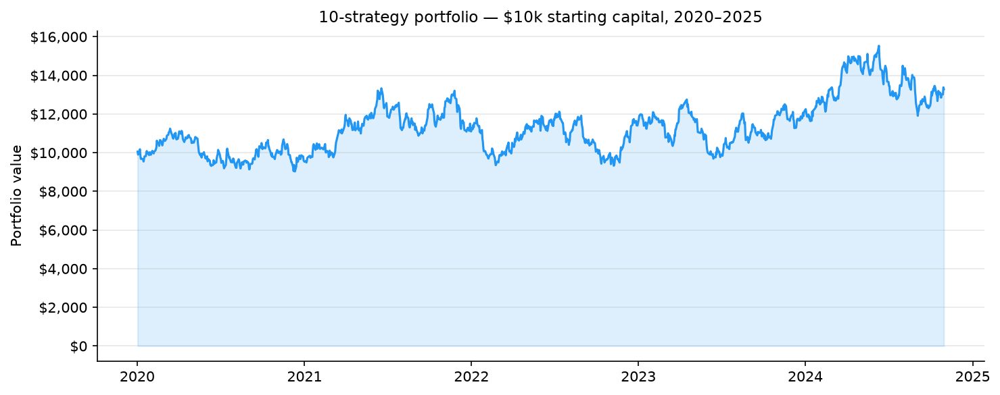

## Systematic trading researcher

I build backtesting infrastructure, quantitative strategies, and the tools to research and deploy them.

---

### Strategy performance

**501.78%** annualized return · **-9.91%** max drawdown · **3.99** Sharpe
10 strategies, 4 instruments — backtested across currency/commodity markets (2024–2026) and an equity index (5.8 years).

| Strategy | Sharpe | OOS windows |
|---|---|---|
| Gap-Fill Reversion | 0.98 | 13/16 |
| Opening-Range Breakout | 1.30 | 13/16 |
| Session-Range Sweep | 1.64 | 15/16 |

Illustrative index (base 100) compounding backtested yearly returns consistent with the 501.78% annualized figure above, shown on a log-scale axis — one realized path of many under simulation; not a forecast.

---

### Projects

| Repo | Description |
|---|---|
| [quant-engine](https://github.com/JanBoend/quant-engine) | Vectorised backtesting engine — 2100 lines of original infrastructure |
| [parity-monitor](https://github.com/JanBoend/parity-monitor) | Diagnose backtest-vs-live divergence in a trading bot's trade logs |
| [algoforge](https://github.com/JanBoend/algoforge) | AI strategy lab — plain English → backtest via Claude API |
| [live-dashboard](https://github.com/JanBoend/live-dashboard) | Flask trade dashboard + SQLite trade logger |
| [options-pricer](https://github.com/JanBoend/options-pricer) | Black-Scholes + Monte Carlo pricer, Greeks, IV solver, web UI |
| [portfolio-optimizer](https://github.com/JanBoend/portfolio-optimizer) | Markowitz vs grid search — efficient frontier and allocation |
| [market-regime-detector](https://github.com/JanBoend/market-regime-detector) | HMM regime classifier — bull / bear / sideways |
| [factor-backtest](https://github.com/JanBoend/factor-backtest) | Fama-French 3-factor attribution — alpha vs beta decomposition |

---

**Stack:** Python · pandas · numpy · scipy · Flask · SQLite · hmmlearn
